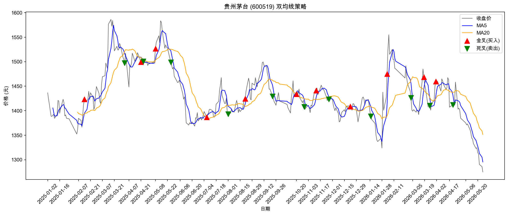

# 📈 贵州茅台股价分析与双均线策略

一个金融科技专业学生的第一个量化分析项目。
使用 Python 获取 A 股真实数据，实现双均线策略，自动标记买卖信号。

## 项目功能

- 自动获取贵州茅台（600519）历史股价数据
- 计算 MA5、MA20 双均线
- 识别金叉（买入信号）和死叉（卖出信号）
- 生成可视化走势图，标注所有买卖点

## 效果展示

## 技术栈

- Python 3.x
- akshare：A 股数据获取
- pandas：数据处理
- matplotlib：数据可视化

## 如何运行

1. 安装依赖：   pip install akshare pandas matplotlib

2. 运行分析脚本：   python analysis.py

3. 输出结果：
   - 终端打印最近10条均线数据及买卖信号
   - 自动保存走势图为 `maotai_ma.png`

## 策略说明

使用 MA5（5日均线）和 MA20（20日均线）构建双均线策略：

- **金叉**：MA5 上穿 MA20，短期趋势强于中期趋势，产生买入信号
- **死叉**：MA5 下穿 MA20，短期趋势弱于中期趋势，产生卖出信号

经回测发现该策略在震荡市中存在滞后性，后续计划引入止损机制和更长周期均线优化。

## 作者

QingcheDi — 金融科技专业大二在读
